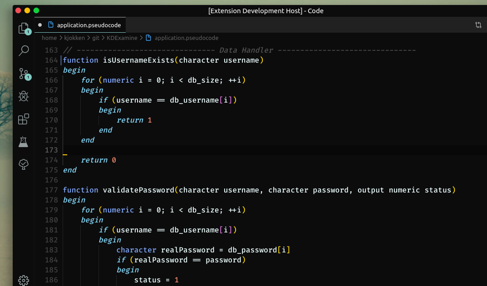

# Pseudolang

Pseudolang is a highlighting guideline to write pseudocode. We know that pseudocode has many variants and no official guide to writing it.

The extension was written by following our module guidelines. Special thanks to all lecturers of **CCIT FT University of Indonesia**.

## Keywords
>Keep in mind there are some of the unimplemented keywords highlights. We hope and appreciate any contribution to make the extension better.

**Code block**  
`begin - end`  

**Function & Procedure**  
`call`  
`return`  

**Variable declaration**  
`character`  
`numeric`  
`function`  
`procedure`  

**Loop**  
`for`  
`while`  
`repeat - until`  

**Conditional**  
`if - else`  
`switch - case`  

**Et cetera**  
`continue`  
`break`  